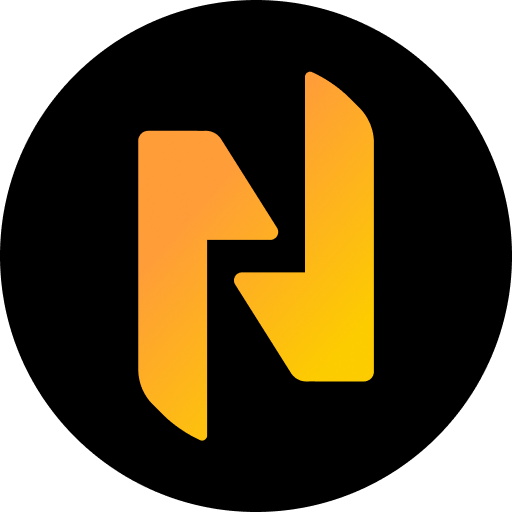

# Next.js NFT Gallery  - Ryo Lambert
BAYC NFT Gallery using Alchemy Ethereum API, React-Virtualized, Next.js 13, Tailwind, & Typescript.
<!-- PROJECT SHIELDS -->
<!--
*** I'm using markdown "reference style" links for readability.
*** Reference links are enclosed in brackets [ ] instead of parentheses ( ).
*** See the bottom of this document for the declaration of the reference variables
*** for contributors-url, forks-url, etc. This is an optional, concise syntax you may use.
*** https://www.markdownguide.org/basic-syntax/#reference-style-links
-->

<!-- PROJECT LOGO -->
<br />
<div align="center">
  <a href="https://github.com/ryolambert/nextjs-nft-gallery">
    
  </a>

<h3 align="center">Next.js NFT Gallery</h3>

  <p align="center">
    Super slick, NFT gallery using Next 13's new image component and custom serverless image loader for blazing fast optimized images.
    <br />
    <a href="https://github.com/ryolambert/nextjs-nft-gallery"><strong>Explore the docs »</strong></a>
    <br />
    <br />
    <a href="https://nextjs-nft-gallery.vercel.app">View Demo</a>
    ·
    <a href="https://github.com/ryolambert/nextjs-nft-gallery/issues">Report Bug</a>
    ·
    <a href="https://github.com/ryolambert/nextjs-nft-gallery/issues">Request Feature</a>
  </p>
</div>


<!-- TABLE OF CONTENTS -->
<details>
  <summary>Table of Contents</summary>
  <ol>
    <li>
      <a href="#about-the-project">About The Project</a>
      <ul>
        <li><a href="#Features">Features</a></li>
        <li><a href="#built-with">Built With</a></li>
      </ul>
    </li>
    <li>
      <a href="#getting-started">Getting Started</a>
      <ul>
        <li><a href="#prerequisites">Prerequisites</a></li>
        <li><a href="#installation">Installation</a></li>
      </ul>
    </li>
    <li><a href="#usage">Usage</a></li>
    <li><a href="#contact">Contact</a></li>
  </ol>
</details>


<!-- ABOUT THE PROJECT -->
## About The Project

[![Product Name Screen Shot][product-screenshot]](https://nextjs-nft-gallery.vercel.app/)

Goal: Building an optimized/cached/searchable Next.js nft gallery with responsive cards using the Alchemy API to fetch the BAYC NFT collection data.

<p align="right">(<a href="#readme-top">back to top</a>)</p>


<!-- FEATURES -->
## Features

- [x] Fetches BAYC collection from Alchemy API
- [x] NFT Cards should show name, tokenId, collection, and token address.
- [x] Gallery is responsive based on screen size.
- [x] Gallery has tokenId search/filtering.
- [x] Gallery implements infinite scroll.

See the [open issues](https://github.com/ryolambert/nextjs-nft-gallery/issues) for a full list of proposed features (and known issues).

<p align="right">(<a href="#readme-top">back to top</a>)</p>


### Built With

* [![Typescript][Typescript.ts]][Typescript-url]
* [![React][React.js]][React-url]
* [![Tailwind][TailwindCSS]][Tailwind-url]
* [![Next][Next.js]][Next-url]
  * Uses SSR rendering for backend api connections to the `alchemy sdk`.
  * Images are prefetched on the server and are both cached (5 min TTL) and optimized as webp files.
  * Custom data fetching hook `useNftGallery` using SSR hydrated client and server instances of `@tanstack/react-query`
* ***React-Virtualized*** Setup basic infinite gallery list that is able to fetch pages of nfts in increments of 100.
* Added a debouced filter component that also uses the same custom data hook to fetch exactly 1 matching NFT to the input and display in the gallery list.


<p align="right">(<a href="#readme-top">back to top</a>)</p>


<!-- GETTING STARTED -->
## Getting Started

### Prerequisites

This is an example of how to list things you need to use the software and how to install them.
* npm
  ```sh
  npm install pnpm -g
  ```

### Installation

1. Get a free API Key at [https://example.com](https://example.com)
2. Clone the repo
   ```sh
   git clone https://github.com/ryolambert/nextjs-nft-gallery.git
   ```
3. Install NPM packages
   ```sh
   npm install
   # or
   yarn
   # or
   pnpm i
   ```
4. Enter your Alchemy API key to `.env.local` or `.env`
   ```dotenv
   ALCHEMY_API_KEY=[Enter given api key]
   ```
5. Start the dev server locally, by running;
   ```bash
   npm run dev
   # or
   yarn dev
   # or
   pnpm dev
   ```
6. Open [http://localhost:3000](http://localhost:3000) with your browser to see the result.

<p align="right">(<a href="#readme-top">back to top</a>)</p>


<!-- CONTACT -->
## Contact

Ryo Lambert - [@twitter_handle](https://twitter.com/twitter_handle) - hi@ryo.dev

Project Link: [https://github.com/ryolambert/nextjs-nft-gallery](https://github.com/ryolambert/nextjs-nft-gallery)

<p align="right">(<a href="#readme-top">back to top</a>)</p>


<!-- MARKDOWN LINKS & IMAGES -->
<!-- https://www.markdownguide.org/basic-syntax/#reference-style-links -->
[product-screenshot]: images/app-screenshot.png
[Next.js]: https://img.shields.io/badge/next.js-000000?style=for-the-badge&logo=nextdotjs&logoColor=white
[Next-url]: https://nextjs.org/
[React.js]: https://img.shields.io/badge/React-20232A?style=for-the-badge&logo=react&logoColor=61DAFB
[React-url]: https://reactjs.org/
[TailwindCSS]: https://img.shields.io/badge/Tailwind_CSS-38B2AC?style=for-the-badge&logo=tailwind-css&logoColor=white
[Typescript.ts]: https://img.shields.io/badge/TypeScript-007ACC?style=for-the-badge&logo=typescript&logoColor=white
